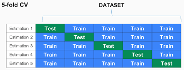

```{r setup, include=FALSE}
knitr::opts_chunk$set(echo = TRUE)
```

# Intro

## Background

Telemarketing is a method of direct marketing which a person (can be sales) prospective customers to buy products or services, either over the phone or through face to face or web conferencing appointment. Telemarketing can also include recoreded sales pithes programmed to be played over the phone by automatic dialing.

Bank is one of the organisation use telemarketing method for selling banking products or services. telemarketing is a popular method used by bank to selling, because bank products and services sometimes too complicated for some users to understand. It more easy to users or target user to understand products or service if it explain directly. One advanteage of telemarketing by person, target users can directly asking question, if they didnt understand something.

Nowdays, Telemarketing has been negatively associated with various scams and frauds, such as pyramid schemes, and with deceptively overpriced products and services. Fraudulent telemarketing companies are frequently referred to as "telemarketing boiler rooms" or simply "boiler rooms". Telemarketing is often criticized as an unethical business practice due to the perception of high-pressure sales techniques during unsolicited calls. Telemarketers marketing telephone companies may participate in telephone slamming, the practice of switching a customer's telephone service without their knowledge or authorization.

Bank as financing organisation really care about good reputation and good branding, and one of bad thing do telemarketing can interfere reputation it self. So we need find out which our target will not buy product or service if bank offer product or service using telemarketing. It can help protect bank reputation by not disturbing target that we already know will not buy the product.

## Analysis Method

In this case we will use machine learning to understand pattern and predict classification or label, we use several predictive model to predict using training and testing data. Predictive model we use is, Naive Bayes Classifier, Decision Tree, and Random Forest. 

We will compare the result of prediction and see the performance from each mode. This 3 model are categorized as supervised learning. Supervised learning popular to predict pattern, this pattern can learn from train data and do ETL (Extract Transform Load) to get feature information. Based from feature we will compare with clasification patter from model get from labeled data to get final prediction.

# Data Preparation

## Import Library

```{r message=FALSE}
# Data wrangling Library
library(tidyverse)
library(dplyr) 

# Visualize data
library(ggplot2)
library(inspectdf)
library(GGally)
library(plotly)

# Naive Bayes 
library(e1071)

# Splitting Data
library(rsample)

# Random Forest
library(randomForest)

# Smote for unbalanced data
library(DMwR)

# ROCR
library(ROCR)

# Confussion Matrix
library(caret)

# Decision Tree
library(partykit)
```


## Import Function 

```{r}
source("matrix_result.R")
source("metrics.R")
```


## Read Data

Telemarketing dataset was obtained from UCI Machine Learning Repository, The data is related with direct marketing campaigns of a Portuguese banking institution. The marketing campaigns were based on phone calls. Often, more than one contact to the same client was required, in order to access if the product (bank term deposit) would be ('yes') or not ('no') subscribed.

```{r message=FALSE}
telemark <- read_csv2("data/bank-full.csv")
```
 
```{r}
glimpse(telemark)
```

Column Description:   
1. `age`: age (numeric)   
2. `job` : type of job (categorical: "admin.","unknown","unemployed","management","housemaid","entrepreneur","student", "blue-collar","self-employed","retired","technician","services")  
3. `marital` : marital status (categorical: "married","divorced","single"; note: "divorced" means divorced or widowed)   
4. `education` : education (categorical: "unknown","secondary","primary","tertiary")   
5. `default`: has credit in default? (binary: "yes","no")   
6. `balance`: average yearly balance, in euros (numeric)   
7. `housing`: has housing loan? (binary: "yes","no")   
8. `loan`: has personal loan? (binary: "yes","no")   
9. `contact`: contact communication type (categorical: "unknown","telephone","cellular")    
10. `day`: last contact day of the month (numeric)   
11. `month`: last contact month of year (categorical: "jan", "feb", "mar", ..., "nov", "dec")   
12. `duration`: last contact duration, in seconds (numeric)   
13. `campaign`: number of contacts performed during this campaign and for this client (numeric, includes last contact)   
14. `pdays`: number of days that passed by after the client was last contacted from a previous campaign (numeric, -1 means client was not previously contacted)   
15. `previous`: number of contacts performed before this campaign and for this client (numeric)   
16. `poutcome`: outcome of the previous marketing campaign (categorical: "unknown","other","failure","success")   
17. `y`: has the client subscribed a term deposit? (binary: "yes","no")

# Data Wrangling

Missing Value (NA) is general problem from dataaset, there's some way to solve the problem. Based on several refrence say that there is NO good way to deal with missing data. So before we going forward to next step, we should check missing value.

```{r}
table(is.na(telemark))
```

The data has no missing value, so we doesnt need any thing with missing value. Based on column description some our imported variables have incorrect data types. Change the data type refer to column description.

```{r}
telemark <- telemark %>% 
  mutate(job = as.factor(job),
         marital = as.factor(marital),
         education = as.factor(education),
         default = as.factor(default),
         housing = as.factor(housing),
         loan = as.factor(loan),
         contact = as.factor(contact),
         month = as.factor(month),
         poutcome = as.factor(poutcome),
         subscribe = as.factor(y)) %>% 
  select(-c(y))
```

There's some of data variables is numeric, we can visualize the histogram to get data distribution from them. 

```{r}
numericCols <- unlist(lapply(telemark, is.numeric))
show_plot(inspect_num(telemark[,numericCols]))
```

Our target variables before are "Y" and we change it to "subscribe", it make us more easy to understand which observer that want to subscribe any product or services when get call from telemarketing. 

```{r}
levels(telemark$subscribe)
```

Our target variables consist of 2 levels "yes" means users agree to subscribe or buy product and "no" means users didnt agree or reject offers from telemarketing. Lets take look at the overall data structure, 

```{r}
summary(telemark)
```

# Exploratory Data Analysis

When conducting a supervised classification with machine learning algorithms such as Random Forests, one recommended practice is to work with a balanced classification dataset. Check proportion of our target variables `subscribe`

```{r}
prop.table(table(telemark$subscribe))
```

We found that our target variable `subsribe` is Imbalanced. It mean data refers to a situation where the number of observations is not the same for all the classes in a classification dataset. To avoid loss of variance, we will use upsampling to balance the proportion.

Lets take look correlation between predictor variables

```{r}
show_plot(inspect_cor(subset(telemark, select = -c(subscribe))))
```

```{r}
ggcorr(telemark, label = T)
```

Two plots above explain, there are some predictor variables have correlation with other predictor variable. These variables are `previous` with `pdays`, `campaign` with `day`, and `balance` with `age`. This didnt make decision us to take out the variables from dataset, but only warn maybe it can cause some models will not work porperly like Naive Bayes.

# Cross Validation

Cross-validation (CV) is a statistical method that can be used to evaluate the performance of models or algorithms where the data is separated into two subsets namely learning process data and validation / evaluation data. In this case we will seperate data with proportion 80% dataset for data training and rest 20% we use as data test.


```{r}
set.seed(1)
split <- initial_split(data = telemark, prop = 0.8, strata = subscribe)
telemark_train <- training(split)
telemark_test <- testing(split)
```

Checking proportion of target variable on train data

```{r}
prop.table(table(telemark_train$subscribe))
```

found target variable still imbalance, so we will try to make it balance using SMOTE method. SMOTE is a oversampling technique which synthesizes a new minority instance between a pair of one minority instance and one of its K nearest neighbor. [see](https://www.jair.org/media/953/live-953-2037-jair.pdf) Other techniques adopt this concept with other criteria in order to generate balanced dataset for class imbalance problem.

```{r}
telemark_train_upsample <- SMOTE(subscribe ~ ., as.data.frame(telemark_train), perc.over = 100, perc.under = 200)
```

```{r}
prop.table(table(telemark_train_upsample$subscribe))
```

We already get balance proportion using SMOTE, then we go throught predictive modelling

# Modelling

We will try to build predictive classification model using different algorithm and method. We will comparing three model and compare result and perfomance of Naive Bayes, Decision Tree, Random Forest

## Naive Bayes 

Based on our EDA we found some of our varibles or we can say it feature have correlaction with other feature. Another feature are continuous variable which based on this 2 point, it make these dataset not really suitable using Naive Bayes. Even so, we still going and try using Naive Bayes to see the result and we will compared with other models.There are certain characteristics of Naive Bayes that should be considered:   

* Assumes that all features of the dataset are equally important and independent. This allows Naive Bayes to perform faster computation (the algorithms is quite simple).   
* Prone to bias due to data scarcity. In some cases, our data may have a distribution where scarce observations lead to probabilities approximating close to 0 or 1, which introduces a heavy bias into our model that could lead to poor performance on unseen data.   
* More appropriate for data with categoric predictors. This is because Naive Bayes is sensitive to data scarcity. Meanwhile, a continuous variable might contain really scarce or even only one observation for certain value.   
* Apply Laplace estimator/smoothing for data scarcity problem. Laplace estimator proposes the adding of a small number (usually 1) to each of the counts in the frequency table. This subsequently ensures that each class-feature combination has a non-zero probability of occurring.

We need build our model, and in this case we also apply Laplace Estimator

```{r}
model_naive <- naiveBayes(subscribe ~ ., data = telemark_train_upsample, laplace = 1)
```

```{r}
naive_prediction <- predict(model_naive, telemark_test)
naive_prediction_raw <- as.data.frame(predict(model_naive, telemark_test, type = "raw"))

naive_prediction_raw <- naive_prediction_raw %>%
  mutate(no = round(no,4),
         yes = round(yes,4))
```


```{r}
naive_matrix <- confusionMatrix(naive_prediction, telemark_test$subscribe, positive = "yes")
table <- as.table(naive_matrix)
table <- as.data.frame(table)

table %>% ggplot(aes(x = Prediction, y = Reference, fill = Freq)) +
  geom_tile() +
  geom_text(aes(label = Freq), fontface = "bold", color = "white") +
  theme_minimal() +
  theme(legend.position = "none")
```

```{r}
naive_matrix <- matrix_result(naive_matrix, "Naive Bayes")
naive_matrix
```

These table explain:
* Accuracy: the ability to correctly predict both classes from the total observation.   
* Precision: the ability to correctly predict the positive class from the total predicted-positive class (false positive is low).   
* Recall: the ability to correctly predict the positive class from the total actual-positive class (false negative is low).   
* Specificity: the ability to correctly predict the negative class from the total actual-negative class.   


```{r}
# ROC
naive_roc <- data.frame(prediction = naive_prediction_raw[,2],
                        trueclass = as.numeric(telemark_test$subscribe=="yes"))
head(naive_roc)
```


```{r}
naive_roc_pred <- prediction(naive_roc$prediction, naive_roc$trueclass) 

# ROC curve
plot(performance(naive_roc_pred, "tpr", "fpr"),
     main = "ROC")
abline(a = 0, b = 1)
```

The ROC is a curve that shows the performance of the classification model for all thresholds. ROC represents graphics from:

* `Recall / sensitivity` (true positive rate) on the` y` axis.
* `1-specificity` (false positive rate) on the` x` axis.

```{r}
# AUC
auc <- performance(naive_roc_pred, measure = "auc")
auc <- auc@y.values[[1]]
auc
```

AUC is the area under the ROC curve. AUC values indicate the success of the model predicting / differentiating the two classes. The area value has an interval between 0 to 1. If the AUC value is close to 1, it means that the classification model is able to predict / distinguish the two classes well. However, if the AUC value is close to 0.5 it means that the classification model is not able to predict / distinguish the two classes well.

* AUC value close to 1: the classification model is able to predict / distinguish the two classes well   
* AUC values close to 0.5: the classification model is not able to predict / distinguish the two classes well   

Based on result ROC and AUC, we get our ROC curce show good separation with AUC score 0.8456519 it mean we have chance to improve this Naive Bayes Model. In Our Naive Bayes model result Accuracy, Sensitivity, Specificity is quite ok, but our positive pred value still small 30%.

In our case we are focus "No" class mean we dont want telemarketing call person who predict didnt want buy product or service offer from telemarketing, it means we are focus on Sensitivity parameter which mean our Naive Bayes already give us good result.

Based on our AUC score we still can improve our model, and one of method to tuning model is change the threshold.


```{r}
# model tuning - metrics function
co <- seq(0.01,0.99,length=100)
result <- matrix(0,100,4)

# apply function metrics
for(i in 1:100){
  result[i,] = metrics(cutoff = co[i], 
                     prob = naive_prediction_raw$yes, 
                     ref = as.factor(ifelse(telemark_test$subscribe == "yes", 1, 0)), 
                     postarget = "1", 
                     negtarget = "0")
}

# visualize
ggplotly(tibble("Recall" = result[,1],
           "Accuracy" = result[,2],
           "Precision" = result[,3],
           "Specificity" = result[,4],
                   "Cutoff" = co) %>% 
  gather(key = "Metrics", value = "value", 1:4) %>% 
  ggplot(aes(x = Cutoff, y = value, col = Metrics)) +
  geom_line(lwd = 1.5) +
  scale_color_manual(values = c("darkred","darkgreen","orange", "blue")) +
  scale_y_continuous(breaks = seq(0,1,0.1), limits = c(0,1)) +
  scale_x_continuous(breaks = seq(0,1,0.1)) +
  labs(title = "Tradeoff Model Perfomance") +
  theme_minimal() +
  theme(legend.position = "top",
        panel.grid.minor.y = element_blank(),
        panel.grid.minor.x = element_blank()))
```

From plot above, we get information break even point is around 0.55. we will set it around 0.52 because we are focusing on Recall parameter, meanwhile we still want other paramaeter get good result.

```{r}
#Tuning Threshold
naive_prediction_tuning <- naive_prediction_raw %>%
  mutate(label = as.factor(ifelse(yes >= 0.52, "yes", "no"))) %>% 
  select(label)
```


```{r}
naive_matrix_tuning <- confusionMatrix(naive_prediction_tuning$label, naive_prediction, positive = "yes")
naive_matrix_tuning <- matrix_result(naive_matrix_tuning, "Naive Bayes Tuning")
naive_matrix_tuning
```

## Decision Tree

Decision tree model is one of the tree-based models which has the major benefit of being interpretable. Decision tree is an algorithm that will make a set of rules visualized in a diagram that resembles a tree. There are certain characteristics of decision tree model:   

* Perform well on both numerical and categorical variable.   
* All predictors are assumed to interact.   
* Quite robust to the problem of multicollinearity. A decision tree will choose a variable that has the highest information gain in one split, whereas a method such as logistic regression would have used both.   
* Robust and insensitive to outliers. Splitting will happen at a condition where it maximizes the homogeneity within resulting groups. Outliers will have little influence on the splitting process.

let build decision tree model.

```{r}
model_dtree <- ctree(subscribe ~ ., telemark_train_upsample)
```

```{r}
width(model_dtree)
depth(model_dtree)
```

We found our decision tree models create complicated tree using our train dataset. it shows from Width 139 it mean total Leaf Nodes, and 14 deoth it mean Internal Nodes. After we train it, we can use to predict using our data test.

```{r}
dtree_prediction <- predict(model_dtree, telemark_test)
```

```{r}
dtree_matrix <- confusionMatrix(dtree_prediction, telemark_test$subscribe, positive = "yes")
dtree_matrix <- matrix_result(dtree_matrix, "Decision Tree")
dtree_matrix
```

In Our Decision model result Accuracy, Sensitivity, Specificity is quite ok, but our positive pred value still small 39%. We still can improve model by tuning it.

```{r}
model_dtree_tuning <- ctree(subscribe ~ ., telemark_train_upsample,
                            control = ctree_control(mincriterion = 0.1, minsplit = 100, minbucket = 60))

dtree_prediction_tuning <- predict(model_dtree_tuning, telemark_test)
```

```{r}
dtree_matrix_tuning <- confusionMatrix(dtree_prediction_tuning, telemark_test$subscribe)
dtree_matrix_tuning <- matrix_result(dtree_matrix_tuning, "Decision Tree Tuning")
dtree_matrix_tuning
```

After we tuning the models we improve the result, and Pos Pred Value incerase significantly from 39% to 96%. This result is more than enought, and it really good. so we didnt do any tuning to make it better

## Random Forest

Random forests are based on a simple idea: 'the wisdom of the crowd'. Aggregate of the results of multiple predictors gives a better prediction than the best individual predictor. A group of predictors is called an ensemble. Thus, this technique is called Ensemble Learning.

To improve our model, we can train a group of Decision Tree classifiers, each on a different random subset of the train set. To make a prediction, we just obtain the predictions of all individuals trees, then predict the class that gets the most votes. This technique is called Random Forest.

One wekness of Random Forest Model is are easy to get over feet with train data, to decrease possibility get overfitted model we can use K-Fold Cross Validation. K- Fold Cross-validation is a resampling procedure used to evaluate machine learning models on a limited data sample.

The procedure has a single parameter called k that refers to the number of groups that a given data sample is to be split into. As such, the procedure is often called k-fold cross-validation. When a specific value for k is chosen, it may be used in place of k in the reference to the model, such as k=10 becoming 10-fold cross-validation.

Cross-validation is primarily used in applied machine learning to estimate the skill of a machine learning model on unseen data. That is, to use a limited sample in order to estimate how the model is expected to perform in general when used to make predictions on data not used during the training of the model.

It is a popular method because it is simple to understand and because it generally results in a less biased or less optimistic estimate of the model skill than other methods, such as a simple train/test split. 

```{r fig.align="center", echo=FALSE}

```


Lets implement it in our random forest model

```{r}
ctrl <- trainControl(method = "repeatedcv", number = 5,repeats = 3)
```

```{r}
# model_rforest <- train(subscribe ~ ., data = telemark_train_upsample, method = "rf", trControl = ctrl, ntree = 100)
# saveRDS(model_rforest, file = "model_rforest.RDS")
model_rforest <- readRDS("model_rforest.RDS")
model_rforest
```

From model summary we have build, we het optimum number of variable considered for splitting at each tree node is 2. Next we will use `varImp()` to get information which feature/variable importance for our random forest model.

```{r}
varImp(model_rforest)
```

We get that `duration` are the most importance variable in our random forest model. and there is other have importance rate more bigger than others is `pdays`, `previous`, `balance`, `age`, `day`.  In practice, the random forest already have out-of-bag estimates (OOB) that can be used as a reliable estimate of its true accuracy on unseen examples. we can check OOB rate in our random forest model

```{r}
model_rforest$finalModel
```


```{r}
plot(model_rforest$finalModel)
legend("topright", colnames(model_rforest$finalModel$err.rate),col=1:6,cex=0.8,fill=1:6)
```

We can start our random forest model to our telemarketing dataset test:

```{r}
rforest_predict <- predict(model_rforest, telemark_test)
rforest_predict_raw <- predict(model_rforest, telemark_test, type = "prob")
```


```{r}
rforest_matrix <- confusionMatrix(rforest_predict, telemark_test$subscribe, positive = "yes")
table <- as.table(rforest_matrix)
table <- as.data.frame(table)

table %>% ggplot(aes(x = Prediction, y = Reference, fill = Freq)) +
  geom_tile() +
  geom_text(aes(label = Freq), fontface = "bold", color = "white") +
  theme_minimal() +
  theme(legend.position = "none")
```


```{r}
rforest_matrix <- matrix_result(rforest_matrix, "Random Forest")
rforest_matrix
```


```{r}
# ROC
forest_roc <- data.frame(prediction = rforest_predict_raw[,2],
                        trueclass = as.numeric(telemark_test$subscribe=="yes"))
head(forest_roc)
```


```{r}
forest_rocz_prediction <- prediction(forest_roc$prediction, forest_roc$trueclass) 

# ROC curve
plot(performance(forest_rocz_prediction, "tpr", "fpr"),
     main = "ROC")
abline(a = 0, b = 1)
```

```{r}
# AUC
auc_ROCR_n <- performance(forest_rocz_prediction, measure = "auc")
auc_ROCR_n <- auc_ROCR_n@y.values[[1]]
auc_ROCR_n
```

Based on result ROC and AUC, we get our ROC curve show good separation with AUC score 0.9214208 it mean our random forest model almost reach the maximum accuracy. In Our Random Forest model result Accuraacy, Sensitivity, Specificity is good performance and accuracy, but our positive pred value still small 44%.

We will try to tune the threshold to reach more higher score on each metrics, especially sensitivity as our target

```{r}
co <- seq(0.01,0.99,length=100)
result <- matrix(0,100,4)

# apply function metrics
for(i in 1:100){
  result[i,] = metrics(cutoff = co[i], 
                     prob = rforest_predict_raw$yes, 
                     ref = as.factor(ifelse(telemark_test$subscribe == "yes", 1, 0)), 
                     postarget = "1", 
                     negtarget = "0")
}

# visualize
ggplotly(tibble("Recall" = result[,1],
           "Accuracy" = result[,2],
           "Precision" = result[,3],
           "Specificity" = result[,4],
                   "Cutoff" = co) %>% 
  gather(key = "Metrics", value = "value", 1:4) %>% 
  ggplot(aes(x = Cutoff, y = value, col = Metrics)) +
  geom_line(lwd = 1.5) +
  scale_color_manual(values = c("darkred","darkgreen","orange", "blue")) +
  scale_y_continuous(breaks = seq(0,1,0.1), limits = c(0,1)) +
  scale_x_continuous(breaks = seq(0,1,0.1)) +
  labs(title = "Tradeoff Model Perfomance") +
  theme_minimal() +
  theme(legend.position = "top",
        panel.grid.minor.y = element_blank(),
        panel.grid.minor.x = element_blank()))
```


```{r}
#Tuning Threshold
rforest_predict_tuning <- rforest_predict_raw %>%
  mutate(label = as.factor(ifelse(yes >= 0.42, "yes", "no"))) %>% 
  select(label)
```


```{r}
rforest_matrix_tuning <- confusionMatrix(rforest_predict_tuning$label, telemark_test$subscribe, positive = "yes")
rforest_matrix_tuning <- matrix_result(rforest_matrix_tuning, "Random Forest Tuning")
rforest_matrix_tuning
```

# Conclusion 

```{r}
result <- rbind(naive_matrix, naive_matrix_tuning, dtree_matrix, dtree_matrix_tuning, rforest_matrix, rforest_matrix_tuning)
result
```

Based on matrix above, we found Naive Bayes Tuning have specificity 100% and Pos Pred Value 100% it indicate our Naive Bayes that we tuning is over fitted. so we can take out from our comparation 

```{r}
result <- result[-2,]
result
```

Overall our predictive model we has build before, Random Forest gave us highest perfomance with 85% accuracy and also maintain sensitivity, specificity more highest than others. In our case we are focus "No" class mean we dont want telemarketing call person who predict didnt want buy product or service offer from telemarketing, it means we are focus on Sensitivity parameter which mean our Naive Bayes already give us good result. so lets find out which model get highest Sensitivty rate


```{r}
result %>% arrange(desc(Sensitivity))
```


Conclusion is random forest with threshold tuning can gave us best perfomance to predict Sensitivty which we try the best to predict which our target we already know they really dont want to buy bank product. so we bank can maintain reputation by didnt disturb target users.

